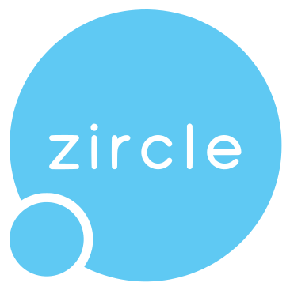

<p align="center">
  <a href="http://zircle.io">
    
  </a>
</p>

<p align="center">
  A circular zooming UI.
</p>

<p align="center">
  <a href="https://www.npmjs.com/package/zircle"></a>
  <a href="https://vuejs.org/"></a>
  <a href="https://travis-ci.org/zircleUI/zircleUI"></a>
</p>

> **Estimated release date of Zircle 0.3.0**: Friday, January 12.

> Zircle is in active development. Feedbacks and contributions are very welcome!

## What is Zircle UI?

**Zircle UI** is a circular zooming user interface library based on Vue.js. It mixes two principles: **circular shapes** and **zooming navigation** in the aim of strengthening each other and create a good user experience.

### Main features
-   Zooming navigation up to 9 level depth.
-   It works well on mobile devices and big screens as it is responsive.
-   It comes with a minimal set of UI components to build your app.
-   It is possible to customize themes and styles to fit your needs. 

## Documentation
To check out live examples and docs, visit http://zircle.io

## Installation
There are several ways to install zircle UI according your needs:

### Direct download 
* Download Zircle from [Github](https://github.com/zircleUI/zircleUI/tree/master/dist)

### Content delivery networks (CDN)

* Include https://unpkg.com/zircle in your project with ```<script>``` tag. With CDN you will have the latest version of Zircle as soon as it is published to npm. You can also browse the source of the npm package at https://unpkg.com/zircle/ 

### NPM
NPM is the recommended installation method of zircle if you are building medium to large scale applications with Vue. 

```bash 
npm install zircle --save
```

> **Note**: When you install Zircle in a fresh project, Vue will also be installed since is a dependency of Zircle. On the other hand, you can install Zircle after you have started a project based on Vue. 

## License
[MIT](http://opensource.org/licenses/MIT)
